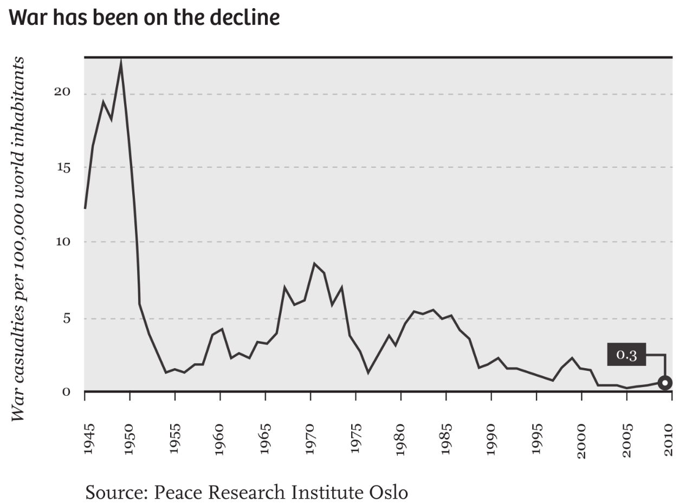
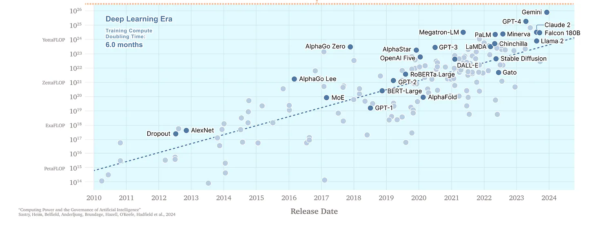
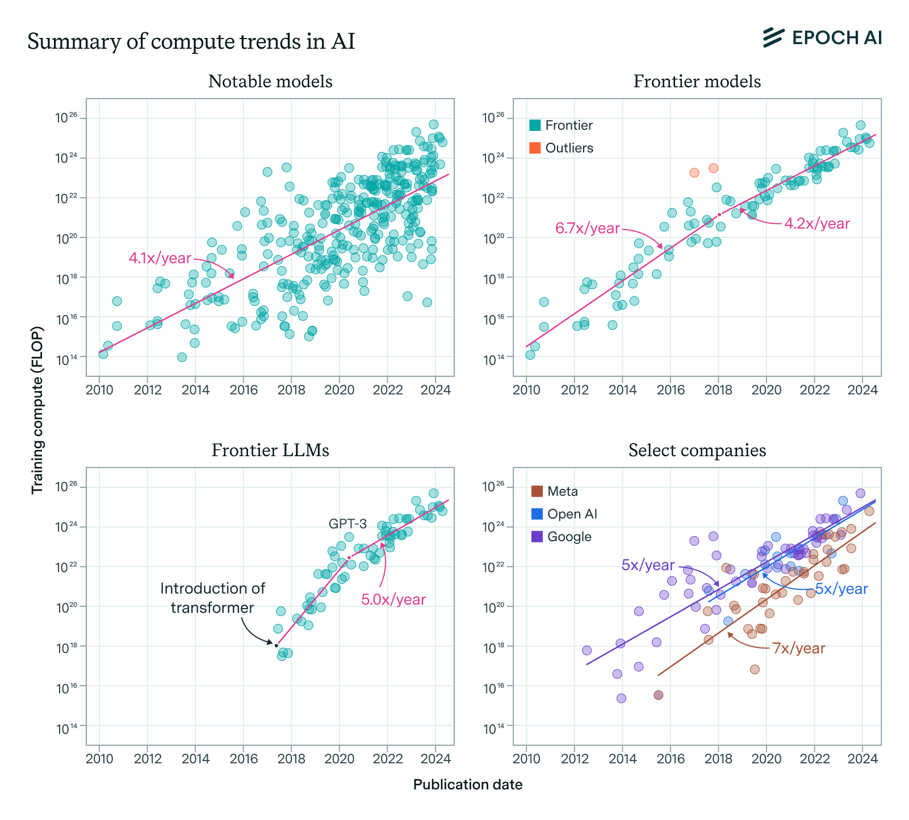
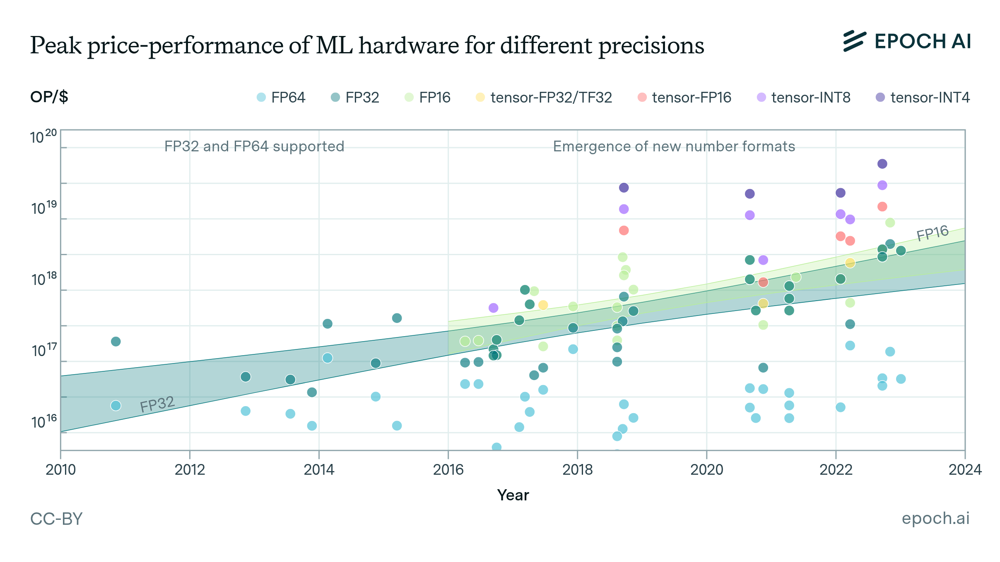
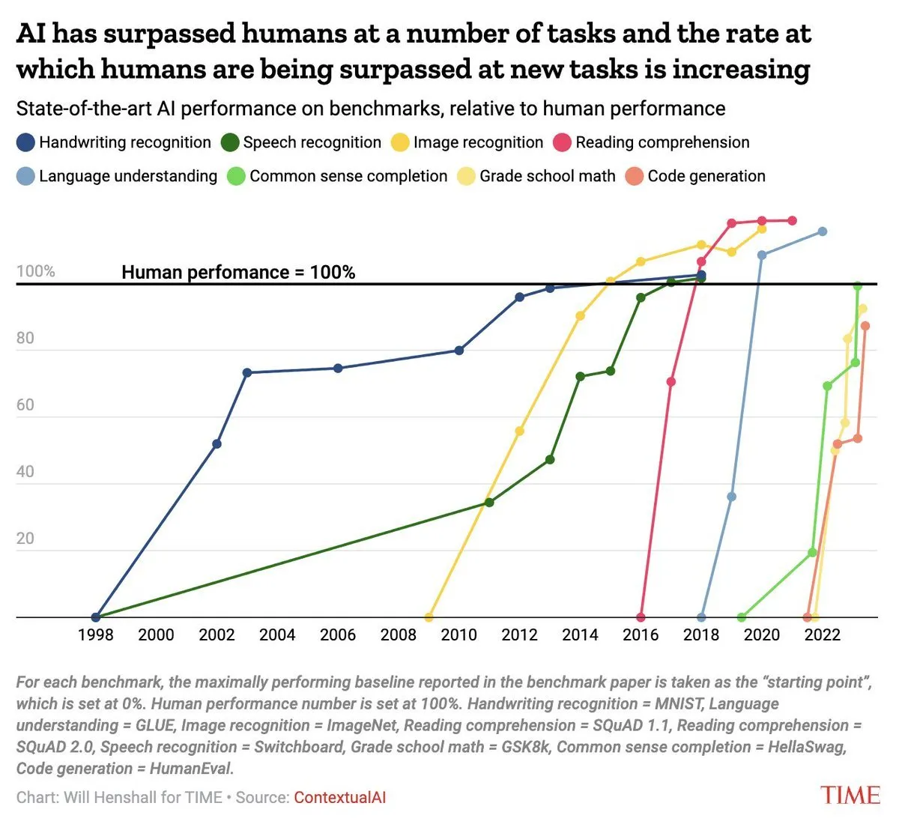
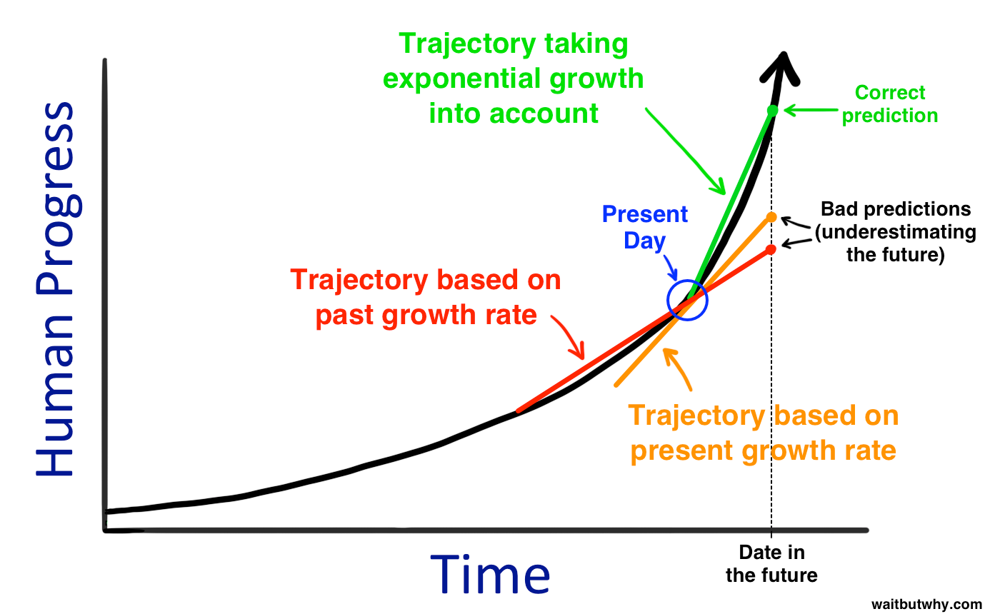
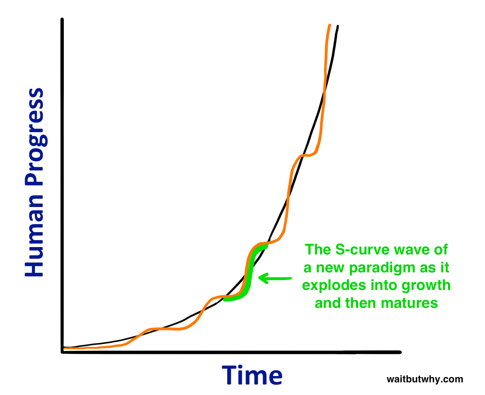
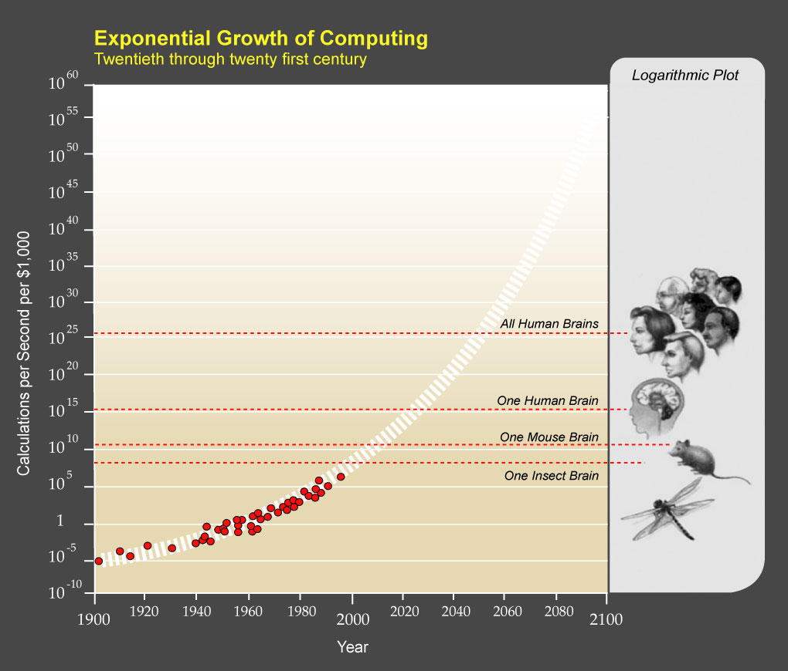
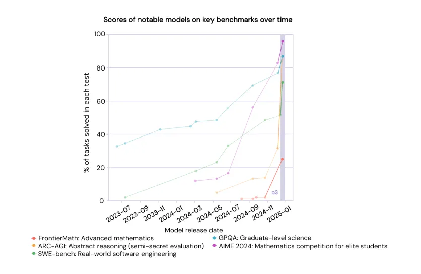
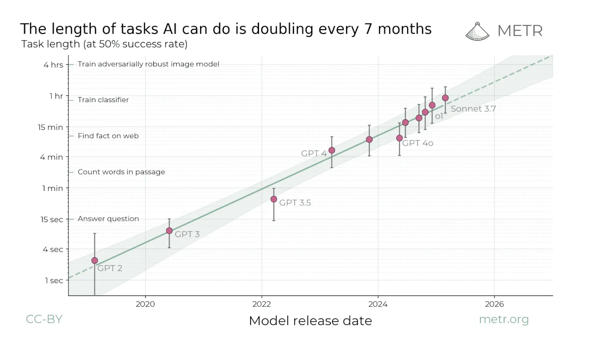

# AGI strategy

Topics
- analyse the technical trends of AI progress and what this implies for future AI capabilities,
- develop a step-by-step story (”kill chain”) for how those capabilities could cause harm to humanity,
- apply a “defence in depth” framework to analyse what needs to be built to defend against your kill chain and steer AI towards safe and beneficial outcomes,
- generate your own action plan for how you'll start contributing to making AI go well.

## [Preparing for launch](https://ifp.org/preparing-for-launch/)

- The sequencing of AI progress matters — where and in what order new capabilities are developed may be just as important as which new capabilities are developed.
- Four guiding principles: 
    1. We should take advantage of the “jagged frontier” of AI capabilities
        - AI’s capabilities don’t advance at an equal pace across all fields
        - Tactics for shaping AI progress should be informed by predictions about where AI will succeed first. 
        - Defence dominant: software ; offence dominant: biosecurity
        - Tracking and predicting AI capability improvements can also help us avoid wasting resources by acting too early. 
    2. We shouldn’t neglect the costs of stalled progress
        -   
    3. We should redesign how many of our scientific institutions work
        - The American science funding ecosystem has become increasingly bureaucratic.
        - Principal investigators spend almost half of their time on grant-related paperwork.
        -  Arc Institute and FutureHouse are independent, nonprofit research organizations that have made large investments in infrastructure-driven “team science.”
        - Other Transactions Authority (OTA) can enable experimentation with new structures for research funding
    4. We should adapt to deep uncertainty while working to reduce it
        - Google’s work on natural language understanding was driven by its desire to produce better search results to sell more ads. These incentives indirectly led to the transformer architecture 
        - Before pivoting to large language models, OpenAI first spent its time exploring deep reinforcement learning for video games and robotics as the most promising paths to AGI. 
        - many uncertainties about AI capabilities and their effects can likely be reduced with a better AI measurement and evaluation ecosystem.
- Many benefits of AI progress may not come quickly (or at all) by default, given existing commercial incentives (there might be none).
- Too little effort is focused on solving the numerous structural barriers to realizing the benefits of AI-enabled scientific discovery.
- AI progress may bring risks that industry is poorly incentivized to solve. In the worst case, private incentives to adequately invest in preventing misuse could be dwarfed by the scale of the risks new AI technologies impose on the public.
- Technical AI safety research: 2% of papers; 100M$ funding / year
- Thanks partly to an instinct towards **nonproliferation**, AI safety researchers have devoted insufficient attention to solutions that assume that dangerous AI capabilities will rapidly diffuse.
  - While nuclear weapons require rare physical materials (uranium, plutonium), AI is primarily software that is easy to copy and steal.
  - Use adaption buffer (time between when a dangerous new capability is first demonstrated and when that capability becomes cheap, easy to use, and widely available via open-source or smaller models; 6-18 months) to build societal resilience.
- Applications that have large amounts of training data (e.g., protein design) and/or lack major real-world bottlenecks (e.g., algorithm development) will see rapid capability improvements. This means that targeted interventions to change these initial conditions could flip the ordering of offensive vs. defensive capability development.
- Private sector investments
  - The US is the R&D lab of the world, and we should act like it.
- [White house AI action plan](https://www.whitehouse.gov/wp-content/uploads/2025/07/Americas-AI-Action-Plan.pdf)
  - Deregulation: Directs agencies (including the FTC, FCC, and SEC) to identify and repeal rules that hinder AI adoption.
  - Open-Source Support: Explicitly encourages the development of "open-weight" models to ensure U.S. standards become the global baseline and to help startups compete without massive capital.
  - Regulatory Sandboxes: Creates safe environments (e.g., within the FDA) for companies to test and deploy AI tools under reduced legal scrutiny.
  - Power Grid Stability: Focuses on upgrading the U.S. electrical grid to handle the massive energy demands of AI clusters, prioritizing reliable sources like nuclear and naoeuvretural gas.
  - Military Infrastructure: Calls for the construction of high-security data centers specifically for intelligence and Department of Defense usage.
  - "Full-Stack" AI Exports: Establishes a program to export "full-stack" packages—including hardware, models, software, and standards—to allied nations, ensuring they run on American technology rather than Chinese alternatives.
  - Strict Controls on Rivals: Tightens export controls on frontier AI chips and cloud compute access to "countries of concern" (primarily China).
  - Biosecurity Screening: Mandates that AI developers and DNA synthesis companies screen for the generation of dangerous pathogens to prevent AI-enabled biological threats.
- By some estimates, the stock of total data generated each year is over a million times greater than the current stock of data publicly available on the internet through the Internet Archive, which contains the bulk of the data used to train LLMs today.
- [Machines of Loving Grace](https://www.darioamodei.com/essay/machines-of-loving-grace)
- Success won’t come from a single master plan, but rather an adaptive strategy that evolves in tandem with AI’s capabilities. Our strategy should not ignore the tremendous upside of the technology, nor ignore the perils of top-down control and centralization. 

## [Utopia for realists](https://drive.google.com/file/d/1nh-Km2J2C99s_LYxby-N53EnZgM2uXHZ/view)

- Where 94% of the world’s population still lived in extreme poverty in 1820, by 1981 that percentage had dropped to 44%, and now, just a few decades later, it is under 10%.
- The average Italian is 15 times as wealthy as in 1880. And the global economy? It is now 250 times what it was before the Industrial Revolution.
- Between 1994 and 2014, the number of people with Internet access world-wide leaped from 0.4% to 40.4%.
- According to the Peace Research Institute in Oslo, the number of war casualties per year has plummeted 90% since 1946.
- 
- Back in 1989, the American philosopher Francis Fukuyama already noted that we had arrived in an era where life has been reduced to “economic calculation, the endless solving of technical problems, environmental concerns, and the satisfaction of sophisticated consumer demands.”
- In fact, most people in wealthy countries believe children will actually be worse off than their parents.
- The real crisis is that we can’t come up with anything better.
- Utopias ultimately become dystopias; in fact, a utopia is a dystopia.
- Radical ideas about a different world have become almost literally unthinkable. The expectations of what we as a society can achieve have been dramatically eroded, leaving us with the cold, hard truth that without utopia, all that remains is a technocracy. Politics has been watered down to problem management.
- The average child living in early 1990s North America was more anxious than psychiatric patients in the early 1950s.
- Progress has become synonymous with economic prosperity, but the 21st century will challenge us to find other ways of boosting our quality of life.
- True progress begins with something no knowledge economy can produce: wisdom about what it means to live well.
- “value ends above means and prefer the good to the useful.”
- What we need are altany serious utopian thinker will be made uncomfortable by the very idea of the blueprint.ernative horizons that spark the imagination.
- Instead of abstract ideals, blueprints consist of immutable rules that tolerate no dissension.
- any serious utopian thinker will be made uncomfortable by the very idea of the blueprint.
- “Man needs, for his happiness, not only the enjoyment of this or that, but hope and enterprise and change,” ... “It is not a finished Utopia that we ought to desire, but a world where imagination and hope are alive and active.”

## [In search of a dynamist vision for safe superhuman AI](https://helentoner.substack.com/p/dynamism-vs-stasis)

- Historically, the way we’ve dealt well with rapidly evolving uncertain processes is classical liberalism.
- The Future and Its Enemies is a manifesto for what Postrel calls “dynamism—a world of constant creation, discovery, and competition.” Its antithesis is “stasis—a regulated, engineered world... [that values] stability and control.”
- In order for civilization to have a general capacity to deal with “black ball” inventions of this type, it would need a system of ubiquitous real-time worldwide surveillance. In some scenarios, such a system would need to be in place before the technology is invented.
- There’s increasing consensus that trying to manage AI risks by exerting massive top-down control could go very badly.
- human agency is a core component of dynamism - a world with AI calling the shots and humans either dead or disempowered would not count as real dynamism, even if there were a vibrant AI economy of invention and creation
- For the future to actually go well, we will need to find our way to some new equilibrium that allows for decentralized experimentation, spontaneous adjustment, creativity, and risk-taking.
- A good bet is differential technological development, aka defensive accelerationism—proactively building technologies that help manage challenges posed by other technologies
- As an overview, dynamist rules:
  1. Allow individuals (including groups of individuals) to act on their own knowledge.
  2. Apply to simple, generic units and allow them to combine in many different ways.
  3. Permit credible, understandable, enduring, and enforceable commitments.
  4. Protect criticism, competition, and feedback.
  5. Establish a framework within which people can create nested, competing frameworks of more specific rules.
-  development of a third-party audit ecosystem also fits
-  value of open models in driving decentralized use, testing, and research is obvious through a dynamist lens

## [It’s practically impossible to run a big AI company ethically](https://archive.ph/9DCPq)

- Is it even possible to run an AI company that advances the state of the art while also truly prioritizing ethics and safety?
- Safe and Secure Innovation for Frontier Artificial Intelligence Model Act, also known as SB 1047. That legislation would require companies training the most advanced and expensive AI models to conduct safety testing and maintain the ability to pull the plug on the models if a safety incident occurs. 
- Anthropic urges, “focus the bill on holding companies responsible for causing actual catastrophes.”
- An Anthropic spokesperson told me that the current version of the bill “could blunt America’s competitive edge in AI development” and that the company wants to “refocus the bill on frontier AI safety and away from approaches that aren’t adaptable enough for a rapidly evolving technology.”
- All major AI companies scrape publicly available data to use in training, a practice they argue is legally protected under fair use.
- Because AI companies need ever-more high-quality data to continue boosting their models’ performance. Using synthetic data, which is created by algorithms, [doesn’t look promising](https://www.nature.com/articles/s41586-024-07566-y).
- “Academic purposes are clearly distinct from commercial purposes and are likely to have different norms.”
- Anthropic has created an experimental governance structure, the Long-Term Benefit Trust, a group of people without financial interest in the company who will ultimately have majority control over it, as they’ll be empowered to elect and remove three of its five corporate directors. (With backdoors for stakeholders ...)
- better AI business ecosystem: positive incentives, like tax breaks for companies that prove they’re upholding the highest safety standards; and negative incentives, like regulation that would fine companies if they deploy biased algorithms. 

## [Seeking Stability in the Competition for AI Advantage](https://www.rand.org/pubs/commentary/2025/03/seeking-stability-in-the-competition-for-ai-advantage.html), [SUPERINTELLIGENCE STRATEGY](https://drive.google.com/file/d/1JVPc3ObMP1L2a53T5LA1xxKXM6DAwEiC/view)

- how the United States and China could compete securely and safely as they develop increasingly capable artificial intelligence (AI)
- Its most provocative proposal is a new concept to avert competition leading to instability among leading AI states that the authors dub “mutually assured AI malfunction,” or MAIM, analogizing it to nuclear mutual assured destruction (MAD). Under MAIM, they argue, “any state's aggressive bid for unilateral AI dominance is met with preventive sabotage by its rivals.”
- Although it is valuable to compare the nuclear and AI revolutions in search of instructive parallels and insights, the differences between the technologies and their respective ecosystems have deep strategic implications.
- If both sides see superintelligent AI as the key to economic and technological dominance, and a potentially existential threat if it is in the hands of an adversary (whether through active hostile intent or if a rival loses control of their AI), the dangers of mutual hostility and aggression can be expected to rise the closer either side gets to achieving it.
- AI nonproliferation—an effort to limit the various risks of proliferating AI through policies and hardware-enabled mechanisms that restrict access to leading-edge AI chips and frontier model weights by nonstate actors. incredibly challenging in practice, is an important priority.
- managed competition, which advocates and seeks to ensure that the United States continues to lead the world in AI development and diffusion. 
- we are already approaching a dynamic similar to nuclear Mutual Assured Destruction (MAD), in which no power dares attempt an outright grab for strategic monopoly, as any such effort would invite a debilitating response. This strategic condition, which we refer to as Mutual Assured AI Malfunction (MAIM), represents a potentially stable deterrence regime
  - First, it does not appear to be a feasible deterrent in practice. Second, a capability to disable an adversary's pursuit of advanced AI would exacerbate rather than dampen the instability of an AI race by creating potent first-strike incentives.
  - cyberattacks and other, less clearly defined forms of sabotage to kinetic attacks on data centers and other AI-supporting facilities
  - distributed cloud computing, decentralized training, and algorithmic development increasingly may not require centralized physical locations
  - challenge resides in the expectation that each party can accurately assess secretive AI progress by others and gauge when preventive action would be necessary
  - even a credible MAIM threat might not deter a rival from pursuing superintelligent AI. Arms prohibition regimes that have been reasonably effective in the past (such as the Non-Proliferation Treaty and the Biological Weapons Convention) draw their strength from the explicit or implicit threat of suffering broader economic, political, or military punishment for violations, not just destruction of the proscribed technological investments.
- MAD did not seek to deter the development of weapons but instead their use, which made the threshold for response vastly simpler
- actively endorsing MAIM would declare U.S. willingness to go to war, if necessary, to prevent Chinese acquisition of a general-purpose technology with profound social and human benefits
- A selective strike on advanced AI infrastructure might also be interpreted as the opening wave of a broader attack on the targeted state's national security.
- In a world of existential threats to homelands from AI progress, states would surely find it untenable to allow private sector actors to take steps which could provoke war

## [The AI Triad and What It Means for National Security Strategy](https://cset.georgetown.edu/wp-content/uploads/CSET-AI-Triad-Report.pdf)

- Three main classes of algorithms are common today: 
  - supervised learning, which draws insights from structured data sets; 
  - unsupervised learning, which excels at finding structure or clusters in unorganized data sets;
  - reinforcement learning, which builds up a machine learning system’s capability through trial and error.

## [Scaling: The State of Play in AI](https://www.oneusefulthing.org/p/scaling-the-state-of-play-in-ai)

- 
- 
- the story of AI capability has largely been a story of increasing model size
- inference compute - the amount of computer power spent “thinking” about a problem, also has a scaling law all its own. 
- one of the most effective ways to improve the accuracy of a model is through having it follow a chain of thought (prompting it, for example: first, look up the data, then consider your options, then pick the best choice, finally write up the results) because it forces the AI to “think” in steps
- the longer a model “thinks,” the better its answer is
- Even if we hit a ceiling on training larger models (which seems unlikely for at least the next couple of generations), AI can still tackle increasingly complex problems by allocating more computing power to "thinking."

## [Trends in AI: Training Costs and Diffusion Speed]()

- Training Compute Spend
  - Increases 2.4× annually (see above)
  - Longer training times with more compute
- Training Compute
  - Increases 5× annually 
  - Larger models + more training data
- Energy Usage
  - Increases 3× annually
  - Massive data centers
- Better Hardware
  - Computing power per dollar improves 1.4× annually 
  - Moore's Law + chip efficiency gains
- Smarter Algorithms
  - The same AI capability needs 3× less computation annually
  - Better training methods + more high-quality data + more "thinking" during use
- 

## [The Most Important Time in History Is Now](https://unchartedterritories.tomaspueyo.com/p/the-most-important-time-in-history-agi-asi)

- 
- Data centers already use 4.5% of electricity demand in the US, and that will probably rise to 7-12% in four years.
- First, synthetic data. We already have physics engines that can create realistic environments that AIs can navigate. For example, they can help train self-driving cars. A more exciting source of synthetic data is simply to use AI to create data to train other AIs. Why does that work? Isn’t that garbage in – garbage out? No, because in many scientific fields, it’s easy to create exercises, get an answer from AIs, and test their accuracy. If the result of the AI-generated exercise is right, the AI is told so. If it is wrong, it is also told that and learns for next time.

## [The AI Revolution: The Road to Superintelligence](https://waitbutwhy.com/2015/01/artificial-intelligence-revolution-1.html)

- This pattern—human progress moving quicker and quicker as time goes on—is what futurist Ray Kurzweil calls human history’s Law of Accelerating Returns. This happens because more advanced societies have the ability to progress at a faster rate than less advanced societies—because they’re more advanced.
- 
- Second, exponential growth isn’t totally smooth and uniform 
- **Singularity**: In 1993, Vernor Vinge wrote a famous essay in which he applied the term to the moment in the future when our technology’s intelligence exceeds our own—a moment for him when life as we know it will be forever changed and normal rules will no longer apply.
-  Artificial Narrow Intelligence (ANI): Sometimes referred to as Weak AI, Artificial Narrow Intelligence is AI that specializes in one area.
-  Artificial General Intelligence (AGI): Sometimes referred to as Strong AI, or Human-Level AI, Artificial General Intelligence refers to a computer that is as smart as a human across the board—a machine that can perform any intellectual task that a human being can.
-  Artificial Superintelligence (ASI): Oxford philosopher and leading AI thinker Nick Bostrom defines superintelligence as “an intellect that is much smarter than the best human brains in practically every field, including scientific creativity, general wisdom and social skills.”
-  “AI has by now succeeded in doing essentially everything that requires ‘thinking’ but has failed to do most of what people and animals do ‘without thinking.'”
-  
-  if the brain is just too complex for us to emulate, we could try to emulate evolution instead.
-  So how can we simulate evolution to build AGI? The method, called “genetic "Long" timelines to advanced AI have gotten crazy shortalgorithms,” would work something like this: there would be a performance-and-evaluation process that would happen again and again
-  The idea is that we’d build a computer whose two major skills would be doing research on AI and coding changes into itself—allowing it to not only learn but to improve its own architecture.
-  A worldwide network of AI running a particular program could regularly sync with itself so that anything any one computer learned would be instantly uploaded to all other computers. 
-  The brain’s neurons max out at around 200 Hz, while today’s microprocessors (which are much slower than they will be when we reach AGI) run at 2 GHz, or 10 million times faster than our neurons. And the brain’s internal communications, which can move at about 120 m/s, are horribly outmatched by a computer’s ability to communicate optically at the speed of light.
-  Computers can expand to any physical size, allowing far more hardware to be put to work, a much larger working memory (RAM), and a longterm memory (hard drive storage) that has both far greater capacity and precision than our own.
-  recursive self-improvement: This is called an Intelligence Explosion, and it’s the ultimate example of The Law of Accelerating Returns.
-  with intelligence comes power

## ["Long" timelines to advanced AI have gotten crazy short](https://helentoner.substack.com/p/long-timelines-to-advanced-ai-have)

- that 2026-2027 is when we’re “most likely” to build “AI that is smarter than almost all humans at almost all things” (Anthropic’s CEO); that AGI will probably be built by January 2029 (OpenAI’s CEO), and that we’re “probably three to five years away” from AGI (Google DeepMind’s CEO).
- discussion of AGI, human-level AI, transformative AI, superintelligence, etc. as “science fiction” should be seen as a sign of total unseriousness
- Suggestions:
  - Advancing the science of AI measurement, so that rather than the current scrappy approach, we have actually-good methods to determine what a given model can and cannot do, how different models compare with each other (and with humans), and how rapidly the frontier is progressing.
  - Advancing the science of interpretability, so we can understand how the hell AI systems work, when they are likely to fail, and when we should(n’t) trust them.
  - Advancing the science of aligning/steering/controlling AI systems, especially systems that are advanced enough to realize when they’re being tested.
  - Fostering an ecosystem of 3rd-party organizations that can verify high-stakes claims AI developers make about their systems, so that governments and the public aren’t dependent on developers choosing to be honest and forthcoming. (IAEA style)
  - Building government capacity on AI, so that there’s real expertise within Congress and the executive branch to handle AI policy issues as they arise.
- How Large Language Models Are Evaluated:
  - **Benchmarks** are a human-curated set of questions and answers aimed at assessing a model. These include benchmarks for assessing models’ broad capabilities as well as identifying ethics and safety concerns. we've been adding on different architectural changes, different ways of gathering and processing data, we're now doing reasoning, we're now doing agents—but it's all continuing along the same branch of the tree, or similar branches.
  - **Red teaming** aims to find holes in model guardrails and other problems with models. 
  - **Custom risk evaluations** may use any number of other experimental techniques to measure properties of interest. 
  - **Evaluations for specific tasks**

## [Unresolved debates about the future of AI]( https://helentoner.substack.com/p/unresolved-debates-about-the-future)

- How far can the current paradigm go?
  - we've been adding on different architectural changes, different ways of gathering and processing data, we're now doing reasoning, we're now doing agents—but it's all continuing along the same branch of the tree, or similar branches.
  - Finding new things you can scale, eg reasoning training, multimodality as a new source of data, figuring out ways to train agentic capabilities at scale
  - one really great way to get data is to have real-world adoption that you can then use to train your future systems
  - Problems: hallucinations, capability-reliability gap, Overconfidence
  - Fundamental limitations: A big one is they can learn things that are in their training data when they're trained in this one big chunky way, and then you can put things in their context window for any individual use case, but we don't really have good ways right now of doing something in between.
- How much can AI improve AI?
  - AlphaEvolve is a result from Google where they use their cutting-edge language models as part of a system to improve algorithms—evolutionary discovery of better and better algorithms.
  - the code underpinning Claude Code itself, the percentage of that that was written by Claude was “probably near 80\%
  - bottlenecks: Errors needing human review
- Will future AIs still basically be tools, or something else?
  - [AI as Normal Technology](https://knightcolumbia.org/content/ai-as-normal-technology)
  - if AI systems continue to be tools, then people are going to be really central. 
  - we really don't have that component-by-component understanding that we're used to having with technologies.
  - Something we're starting to see is AI systems that notice and remark on the fact that a testing situation that they're put in, some strange hypothetical, seems like it's a test.
  - there are very strong financial/commercial incentives to build AI systems that are very autonomous and that are very general
  - "We should expect volition for independence to be a direct outcome of developing AI systems that are asked to do a broad range of hard cognitive tasks."
  - think of AI as an optimization process, maybe a self-sustaining optimization process, of the kind that maybe a market is or a bureaucracy is

## [Why do people disagree about when powerful AI will arrive?](https://blog.bluedot.org/p/agi-timelines)

- The case for short timelines
  - Benchmarks keep saturating 
  - AIs are able to complete longer and longer tasks 
  - AI research might be the only capability we need to automate to achieve AGI
  - We could train much bigger models before 2030
    - Today’s most powerful AI systems are trained using three inputs – data (largely internet text), algorithms (instructions for learning from this data) and compute (the cutting-edge chips used to power the entire process).
    - compute is the most important ingredient in the AI development process
  - People’s timelines keep getting shorter
    - On the the forecasting platform Metaculus, the predicted date for AGI’s development has dropped by over two decades since 2022
- The case for long timelines
  - Benchmarks only tell us about capabilities that are easy to measure
  - Benchmarks are best for clearly-defined tasks, where success is easily verified. AI models are particularly good at these kinds of tasks. This is especially true for more recent reasoning models such as OpenAI’s o1, which rely heavily on reinforcement learning (RL).
- Tasks that are easy for humans are hard for AIs – and vice-versa
  -  Moravec’s Paradox: reasoning requires far less computation than sensorimotor skills.
- An intelligence explosion might not be possible
   -  how much algorithmic progress could a team of automated researchers make while compute and data remain static?
- Raw intelligence might not be the main driver of discovery
  - Skeptics will point out that there’s much more to R&D than just very smart people thinking very hard. One piece of evidence for this is the phenomenon of simultaneous discovery.  hypothesis: culture moves faster than scientific discovery, creating a lag which people will then seek technical solutions or explanations for.
- Many believe that AGI will either happen before 2030, or take much longer. This is because we probably can’t sustain our current rate of scaling past this point. We could build compute clusters that cost $1 trillion in five years’ time. This is probably close to the limit of what the US economy could sustain. This suggests that if we get to 2030 with no AGI, the yearly probability starts to decrease.

- AI scaffolding: broad term for ways of augmenting an AI model’s capabilities after it has been trained
  - external tools, prompting itself, Letting AIs work together

## [Common Ground between AI 2027 & AI as Normal Technology](https://asteriskmag.substack.com/p/common-ground-between-ai-2027-and)

- Before strong AGI, AI will be a normal technology
  - AI will mostly function as a tool; it won’t be capable of operating autonomously for long periods.
- Strong AGI developed and deployed in the near future would not be a normal technology.
  - Slow process: the notion of “Strong AGI”, or any other notion of AGI, is a joint property of the system and its environment. They think strong AGI won’t be developed in the lab (say, by scaling LLMs). Rather, building strong AGI will require a feedback loop with the real world that would set limits to the pace of progress.
  - Fast process:  current developments as harbingers of strong AGI. They expect progress to be continuous, but rapid, and to accelerate dramatically when AIs fully automate AI research. 
- Most existing benchmarks will likely saturate soon.
  - saturation does not mean that the underlying task will be easy to automate
  -  important gap between benchmark scores and real-world utility
- AIs may still regularly fail at mundane human tasks; Strong AGI may not arrive this decade.
   - It is simultaneously possible that AI systems can solve tasks well on average, and yet behave far worse than any human would in the worst case scenario. 
   - We all expect that strong AGI will probably not arrive before 2029, and in early 2029 the world will probably still look basically like it does today.
   - AIs will not be able to independently discover new science.
- AI will be (at least) as big a deal as the internet.
  - In the long run, they expect AI could automate most cognitive tasks, just as the industrial revolution led to the automation of most physical tasks, in the sense that machines are now responsible for vastly more physical work than the human population.
  - they expect AI impacts to largely follow the path of previous general-purpose technologies, which are bottlenecked by barriers to diffusion and adoption rather than capabilities.
  - there would still be a lot left for humans to do — like controlling AI systems, and deciding how they should be used
- AI alignment is unsolved.
  - We all agree that on the current trajectory, AIs will continue to be misaligned, often in ways that aren’t detected by evaluations. Therefore, we all agree that we should not rely on AI alignment as our last (or only) line of defense against misaligned advanced AI. 
  - we should be cautious about how much trust is placed in AI systems, and not give them enough power to pose a catastrophic risk if misaligned.
- AIs must not make important decisions or control critical systems.
- Transparency, auditing, and reporting are beneficial.
- Governments must build capacity to track and understand developments in the AI industry.
  - Governments can play a role in evaluating AI models (especially for domains that have national security implications), solving coordination problems, such as when the defenses need to be implemented by actors other than AI companies, and understanding and reacting appropriately to new developments.
- Diffusion of AI into the economy is generally good.
  - Deploying AI may also help build resilience, as defenders can figure out how to use these systems to enable better responses to risks like cyber-attacks and other AI-enabled threats.
  - help us learn more about AI, its strengths and weaknesses, its opportunities and risks.
- A secret intelligence explosion — or anything remotely similar — would be bad, and governments should be on the lookout for it.
  - Tech companies like OpenAI and Anthropic are explicitly planning to automate their own jobs as fast as possible
  - The resulting “recursive self-improvement” could result in an “intelligence explosion” of rapid capability gains (at least, that’s what the authors of AI 2027 expect) or it could be bottlenecked by other factors such as the lack of real-world data (at least, that’s what the authors of AI as Normal Technology expect).

## Week 2 discussion
- METR is paid my AI labs
- For other industries, regulations are written in blood (something had to happen before regulation)
- Government officials are very short-sighted about the AI progress, seeing only the productivity gains, believing that big investments mean big importance
- We need better communication between the technical experts and the governing bodies
- Will there be an incentive to keep normal humans around as AGI leader?
  - Compare countries where GDP is based on cognitive work rather than natural resources. In the latter, there in no incentive to educate or feed the population. AI would be an extreme version of the latter. 
- TODO: How can we communicate between politics and science better, understanding incentives of politicians?