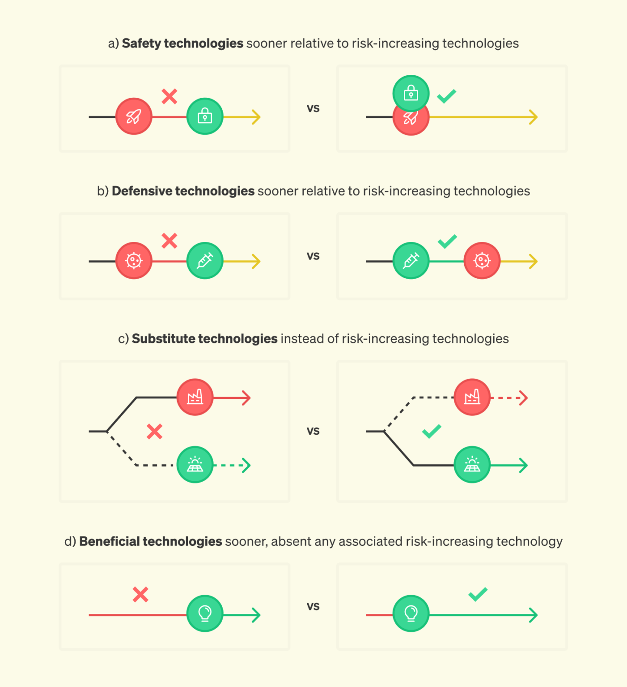
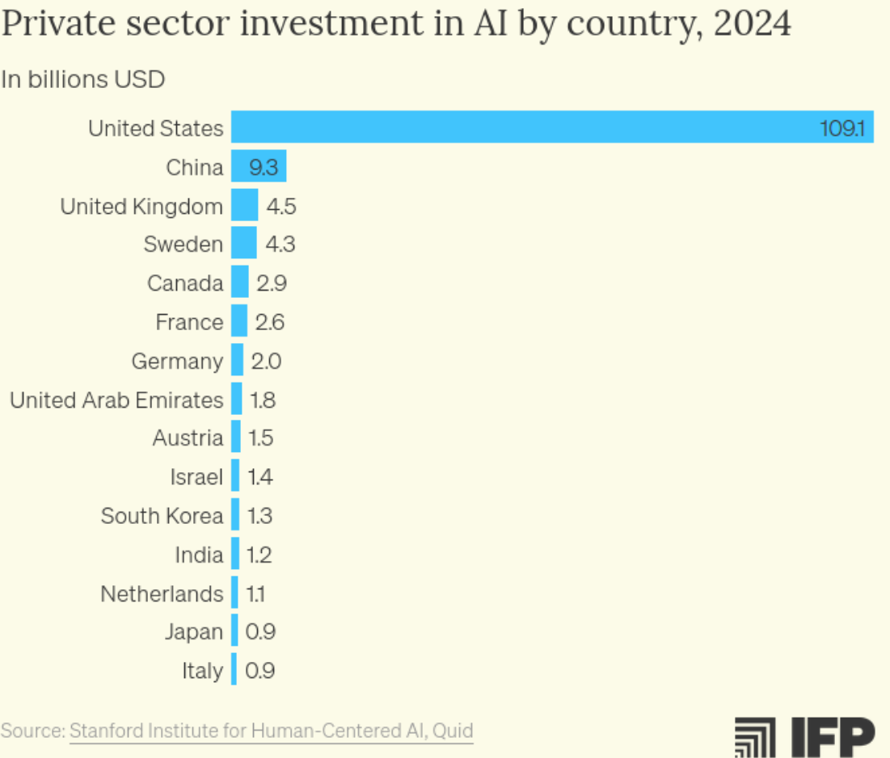

# AGI strategy

Topics
- analyse the technical trends of AI progress and what this implies for future AI capabilities,
- develop a step-by-step story (”kill chain”) for how those capabilities could cause harm to humanity,
- apply a “defence in depth” framework to analyse what needs to be built to defend against your kill chain and steer AI towards safe and beneficial outcomes,
- generate your own action plan for how you'll start contributing to making AI go well.

## [Preparing for launch](https://ifp.org/preparing-for-launch/)

- The sequencing of AI progress matters — where and in what order new capabilities are developed may be just as important as which new capabilities are developed.
- Four guiding principles: 
    1. We should take advantage of the “jagged frontier” of AI capabilities
        - AI’s capabilities don’t advance at an equal pace across all fields
        - Tactics for shaping AI progress should be informed by predictions about where AI will succeed first. 
        - Defence dominant: software ; offence dominant: biosecurity
        - Tracking and predicting AI capability improvements can also help us avoid wasting resources by acting too early. 
    2. We shouldn’t neglect the costs of stalled progress
        -   
    3. We should redesign how many of our scientific institutions work
        - The American science funding ecosystem has become increasingly bureaucratic.
        - Principal investigators spend almost half of their time on grant-related paperwork.
        -  Arc Institute and FutureHouse are independent, nonprofit research organizations that have made large investments in infrastructure-driven “team science.”
        - Other Transactions Authority (OTA) can enable experimentation with new structures for research funding
    4. We should adapt to deep uncertainty while working to reduce it
        - Google’s work on natural language understanding was driven by its desire to produce better search results to sell more ads. These incentives indirectly led to the transformer architecture 
        - Before pivoting to large language models, OpenAI first spent its time exploring deep reinforcement learning for video games and robotics as the most promising paths to AGI. 
        - many uncertainties about AI capabilities and their effects can likely be reduced with a better AI measurement and evaluation ecosystem.
- Many benefits of AI progress may not come quickly (or at all) by default, given existing commercial incentives (there might be none).
- Too little effort is focused on solving the numerous structural barriers to realizing the benefits of AI-enabled scientific discovery.
- AI progress may bring risks that industry is poorly incentivized to solve. In the worst case, private incentives to adequately invest in preventing misuse could be dwarfed by the scale of the risks new AI technologies impose on the public.
- Technical AI safety research: 2% of papers; 100M$ funding / year
- Thanks partly to an instinct towards **nonproliferation**, AI safety researchers have devoted insufficient attention to solutions that assume that dangerous AI capabilities will rapidly diffuse.
  - While nuclear weapons require rare physical materials (uranium, plutonium), AI is primarily software that is easy to copy and steal.
  - Use adaption buffer (time between when a dangerous new capability is first demonstrated and when that capability becomes cheap, easy to use, and widely available via open-source or smaller models; 6-18 months) to build societal resilience.
- Applications that have large amounts of training data (e.g., protein design) and/or lack major real-world bottlenecks (e.g., algorithm development) will see rapid capability improvements. This means that targeted interventions to change these initial conditions could flip the ordering of offensive vs. defensive capability development.
- Private sector investments
  - The US is the R&D lab of the world, and we should act like it.
- [White house AI action plan](https://www.whitehouse.gov/wp-content/uploads/2025/07/Americas-AI-Action-Plan.pdf)
  - Deregulation: Directs agencies (including the FTC, FCC, and SEC) to identify and repeal rules that hinder AI adoption.
  - Open-Source Support: Explicitly encourages the development of "open-weight" models to ensure U.S. standards become the global baseline and to help startups compete without massive capital.
  - Regulatory Sandboxes: Creates safe environments (e.g., within the FDA) for companies to test and deploy AI tools under reduced legal scrutiny.
  - Power Grid Stability: Focuses on upgrading the U.S. electrical grid to handle the massive energy demands of AI clusters, prioritizing reliable sources like nuclear and natural gas.
  - Military Infrastructure: Calls for the construction of high-security data centers specifically for intelligence and Department of Defense usage.
  - "Full-Stack" AI Exports: Establishes a program to export "full-stack" packages—including hardware, models, software, and standards—to allied nations, ensuring they run on American technology rather than Chinese alternatives.
  - Strict Controls on Rivals: Tightens export controls on frontier AI chips and cloud compute access to "countries of concern" (primarily China).
  - Biosecurity Screening: Mandates that AI developers and DNA synthesis companies screen for the generation of dangerous pathogens to prevent AI-enabled biological threats.
- By some estimates, the stock of total data generated each year is over a million times greater than the current stock of data publicly available on the internet through the Internet Archive, which contains the bulk of the data used to train LLMs today.
- [Machines of Loving Grace](https://www.darioamodei.com/essay/machines-of-loving-grace)
- Success won’t come from a single master plan, but rather an adaptive strategy that evolves in tandem with AI’s capabilities. Our strategy should not ignore the tremendous upside of the technology, nor ignore the perils of top-down control and centralization. 